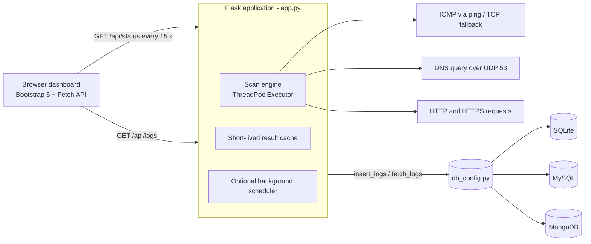

# Secure Hybrid Network & Server Monitoring Dashboard

A production-style network operations dashboard that continuously checks the health of **IP hosts, DNS resolvers and web endpoints**, stores every result in a database, and presents live status and historical trends in a responsive web UI.

It combines **core networking** (ICMP, TCP handshakes, raw DNS over UDP, HTTP/TLS) with **backend engineering and DevOps practice** (REST API, pluggable databases, structured logging, environment-based secrets, containerless PaaS deployment).

| | |
|---|---|
| **Backend** | Python 3.10+, Flask, Gunicorn |
| **Databases** | SQLite (zero-config default), **MySQL**, **MongoDB** - switch with one environment variable |
| **Frontend** | HTML5, CSS3, JavaScript (Fetch API), Bootstrap 5, Chart.js |
| **Operations** | Rotating log files, health-check endpoint, retention policy, Render/Railway ready |

---

## Why this project matters

Enterprise IT teams, managed-service providers and data-centre operators in the UAE and elsewhere need immediate answers to three questions: *Is it up? How fast is it? What happened over the last hour?* Commercial tools (Nagios, Zabbix, PRTG, Datadog) answer these at scale, but the same fundamentals sit underneath all of them. This project implements those fundamentals from first principles.

### Real-world use cases

- **Branch and site connectivity** - confirm that gateways, VPN endpoints and firewalls at remote offices respond, and see latency trends before users complain.
- **DNS resolver health** - verify that internal or public resolvers actually *answer queries*, not merely that the server is pingable. A resolver that is up but failing to resolve is a classic hidden outage.
- **SaaS and web-application availability** - track customer-facing URLs, internal portals and APIs, including TLS certificate failures and HTTP error codes.
- **Hybrid cloud visibility** - one dashboard for on-premises servers and cloud-hosted services, deployable on any PaaS or on a small VM inside the network.
- **Audit trail and SLA evidence** - every scan is timestamped in the database and exportable to CSV for incident reviews and uptime reporting.

---

## Features

- **Three check types, one engine**
  - `ip` - ICMP echo through the OS `ping` binary (`subprocess`, no shell, validated input). Automatically falls back to a **TCP three-way handshake** when ICMP is blocked or unavailable, which is the normal situation inside cloud containers.
  - `dns` - hand-built **DNS query over UDP port 53** (RFC 1035) with transaction-ID and response-code validation.
  - `url` - HTTP(S) request with separate connect/read timeouts, redirect handling and TLS error detection.
- **Cross-platform ping** - correct flags and output parsing for Windows, Linux and macOS.
- **Parallel scanning** - a thread pool checks all targets at once, so scan time equals the slowest target, not the sum.
- **Graceful failure handling** - every timeout, refused connection, DNS failure and certificate error is caught and reported as a readable reason. A single bad target can never break a scan.
- **Persistent history** - each scan stores *timestamp, host name, IP/address, status and response time*.
- **Live dashboard** - auto-refreshes every 15 seconds with the Fetch API; status cards with animated indicator rings, availability and latency meters, a health doughnut, a per-target latency chart, a filterable scrollable history table and CSV export.
- **Load protection** - results are cached briefly so many open browsers do not multiply traffic to monitored systems; the manual *Force scan* button is rate-limited.
- **Professional logging** - console plus rotating `netmon.log` and a separate `netmon-errors.log`.
- **Security hygiene** - secrets only via environment variables, validated target addresses, no shell execution, parameterised SQL, HTML escaping in the UI, CSV formula-injection protection, baseline security headers.
- **Resilient start-up** - if the database is down at boot, the dashboard still runs and storage resumes automatically when it returns.

---

## Architecture



### Project structure

```
secure-network-monitor/
├── app.py                  # Flask backend: scan engine, REST API, scheduler, logging
├── db_config.py            # SQLite | MySQL | MongoDB behind one interface
├── targets.json            # Monitored infrastructure
├── requirements.txt
├── Procfile                # Railway / Heroku-style process definition
├── render.yaml             # Render Blueprint
├── .env.example            # Configuration template
├── templates/
│   └── index.html          # Dashboard UI
├── data/                   # (auto-created) SQLite file
└── logs/                   # (auto-created) rotating logs
```

---

## Local installation

### Prerequisites

- Python **3.10 or newer** (`python --version`)
- Git (optional)
- MySQL 8 or MongoDB 6+ only if you want to use those backends

### 1. Get the code and create a virtual environment

**Windows (PowerShell)**
```powershell
cd secure-network-monitor
python -m venv .venv
.venv\Scripts\Activate.ps1
pip install -r requirements.txt
```

**Linux / macOS**
```bash
cd secure-network-monitor
python3 -m venv .venv
source .venv/bin/activate
pip install -r requirements.txt
```

### 2. Configure

```bash
cp .env.example .env        # Windows: copy .env.example .env
```

The default (`DB_BACKEND=sqlite`) needs no further setup. Edit `targets.json` to monitor your own infrastructure (see [Configuring targets](#configuring-targets)).

### 3. Run

```bash
python app.py
```

Open **http://127.0.0.1:5000**. The first scan starts immediately; history builds with every refresh.

---

## Choosing a database

Switch engines by changing `DB_BACKEND` in `.env`. The application code does not change.

### SQLite (default)

```ini
DB_BACKEND=sqlite
```

The file `data/netmon.db` is created automatically.

### MySQL

1. Start a server (Docker shown; any MySQL 8 installation works):
   ```bash
   docker run -d --name netmon-mysql -p 3306:3306 \
     -e MYSQL_ROOT_PASSWORD=choose-a-root-password \
     -e MYSQL_DATABASE=netmon \
     -e MYSQL_USER=netmon \
     -e MYSQL_PASSWORD=choose-an-app-password \
     mysql:8.0
   ```
   On an existing server, create the database and a least-privilege user instead:
   ```sql
   CREATE DATABASE netmon CHARACTER SET utf8mb4 COLLATE utf8mb4_unicode_ci;
   CREATE USER 'netmon'@'%' IDENTIFIED BY 'choose-an-app-password';
   GRANT SELECT, INSERT, DELETE, CREATE, INDEX ON netmon.* TO 'netmon'@'%';
   ```
2. Set the variables in `.env`:
   ```ini
   DB_BACKEND=mysql
   MYSQL_HOST=127.0.0.1
   MYSQL_PORT=3306
   MYSQL_USER=netmon
   MYSQL_PASSWORD=choose-an-app-password
   MYSQL_DATABASE=netmon
   ```
3. Start the app. The `scan_logs` table and its indexes are created automatically.

### MongoDB

1. Start a server (Docker shown) or create a free MongoDB Atlas cluster:
   ```bash
   docker run -d --name netmon-mongo -p 27017:27017 mongo:7
   ```
2. Set the variables in `.env`:
   ```ini
   DB_BACKEND=mongodb
   MONGODB_URI=mongodb://localhost:27017
   MONGODB_DB=netmon
   ```
   For Atlas, use the `mongodb+srv://...` connection string from *Connect > Drivers*.
3. Start the app. The collection and indexes are created automatically.

> **Stored fields (all backends):** `scanned_at` (UTC), `host_name`, `ip_address`, `target_type`, `status`, `response_time_ms`.

---

## Configuring targets

Targets live in `targets.json` (or in the `TARGETS_JSON` environment variable, convenient on hosting platforms).

```json
[
  { "name": "Core DNS",     "address": "8.8.8.8",              "type": "dns", "query_domain": "google.com" },
  { "name": "Edge Gateway", "address": "1.1.1.1",              "type": "ip",  "method": "icmp", "port": 443 },
  { "name": "Customer Web", "address": "https://example.com",  "type": "url", "max_status": 399 }
]
```

| Field | Applies to | Meaning |
|---|---|---|
| `name` | all | Display name (must be unique; used in logs and charts) |
| `address` | all | IP / hostname for `ip` and `dns`; full `http(s)://` URL for `url` |
| `type` | all | `ip`, `dns` or `url` |
| `timeout` | all | Seconds to wait (default 3, or 5 for URLs) |
| `method` | `ip` | `icmp` (default) or `tcp` |
| `port` | `ip` | TCP port used as fallback when ICMP fails or is unavailable |
| `query_domain` | `dns` | Domain asked of the resolver (default `google.com`) |
| `max_status` | `url` | Highest HTTP status still counted as ONLINE (default 399) |

Invalid entries are skipped and reported in the log, never crash the app.

---

## Configuration reference

| Variable | Default | Purpose |
|---|---|---|
| `DB_BACKEND` | `sqlite` | `sqlite`, `mysql` or `mongodb` |
| `SQLITE_PATH` | `data/netmon.db` | SQLite file location |
| `MYSQL_HOST` `MYSQL_PORT` `MYSQL_USER` `MYSQL_PASSWORD` `MYSQL_DATABASE` | see `.env.example` | MySQL connection (Railway-style `MYSQLHOST` etc. are also read) |
| `MYSQL_SSL_CA` / `MYSQL_SSL_DISABLED` | unset | TLS options for managed MySQL |
| `MONGODB_URI` / `MONGODB_DB` | `mongodb://localhost:27017` / `netmon` | MongoDB connection |
| `SCAN_TIMEOUT_SECONDS` / `HTTP_TIMEOUT_SECONDS` | `3` / `5` | Default check timeouts |
| `REFRESH_INTERVAL_SECONDS` | `15` | Dashboard auto-refresh period |
| `SCAN_CACHE_TTL_SECONDS` | `10` | Reuse a scan younger than this |
| `ENABLE_BACKGROUND_SCHEDULER` | `false` | Keep scanning with no browser open |
| `BACKGROUND_SCAN_SECONDS` | `60` | Scheduler interval |
| `LOG_RETENTION_DAYS` | `30` | Automatic purge of old records (`0` = keep all) |
| `TARGETS_FILE` / `TARGETS_JSON` | `targets.json` / unset | Alternative target sources |
| `HOST` / `PORT` | `127.0.0.1` / `5000` | Development server binding |
| `LOG_LEVEL` / `LOG_DIR` | `INFO` / `logs/` | Logging |
| `CORS_ORIGINS` | `*` | Allowed origins for `/api/*` (restrict in production) |

---

## REST API

| Method & path | Description |
|---|---|
| `GET /` | Dashboard |
| `GET /api/status` | Runs (or reuses a fresh) scan, stores it, returns the current state. Add `?force=1` to request a new scan. |
| `GET /api/logs?limit=100&host=&status=` | Stored history, newest first (`limit` max 1000; `status` = `ONLINE` or `OFFLINE`) |
| `GET /api/health` | Liveness probe for hosting platforms |

```bash
curl -s http://127.0.0.1:5000/api/status | python -m json.tool
```

```json
{
  "scanned_at": "2026-10-08T09:30:00.123Z",
  "summary": { "total": 8, "online": 7, "offline": 1, "availability_pct": 87.5, "avg_response_ms": 34.2, "health": "degraded" },
  "targets": [
    { "name": "Google Public DNS", "address": "8.8.8.8", "type": "dns", "status": "ONLINE", "response_time_ms": 12.4, "detail": "Resolved google.com" }
  ],
  "db": { "backend": "mongodb", "logged": true, "rows": 8 },
  "cached": false
}
```

---

## Production deployment (free hosting)

Both platforms deploy straight from a GitHub repository. Push this project to a new repository first:

```bash
git init
git add .
git commit -m "Secure Hybrid Network & Server Monitoring Dashboard"
git branch -M main
git remote add origin https://github.com/<your-username>/secure-network-monitor.git
git push -u origin main
```

> **Run one worker.** The scan cache and the optional scheduler live in process memory, so the provided start command uses `--workers 1 --threads 4`. Threads give concurrency without duplicating the scheduler.

> **ICMP on PaaS.** Cloud containers often have no `ping` binary or forbid raw ICMP. The app detects this and falls back to the `port` you set on each `ip` target, so give every `ip` target a `port` (443 or 53 are good choices).

### Option A - Render.com

**Fast path (Blueprint)**

1. Sign in to [render.com](https://render.com) and connect your GitHub account.
2. Select **New > Blueprint** and choose your repository. Render reads `render.yaml`.
3. Review the service and click **Apply**. The build runs `pip install -r requirements.txt` and starts Gunicorn.
4. When the deploy is live, open the `onrender.com` URL shown on the service page.

**Manual path**

1. **New > Web Service** and select the repository.
2. Runtime **Python 3**; Build Command `pip install -r requirements.txt`.
3. Start Command: `gunicorn app:app --workers 1 --threads 4 --timeout 60 --bind 0.0.0.0:$PORT`
4. Instance type **Free**. Under **Advanced** set *Health Check Path* to `/api/health`.
5. Add environment variables (below), then **Create Web Service**.

**Persistent history with a free database**

Render's free web service has an **ephemeral filesystem**, so a SQLite file is wiped on every restart, redeploy and spin-down. For history that survives, use MongoDB Atlas (free M0 tier):

1. Create an Atlas cluster, a database user, and under *Network Access* allow connections from your host (Render's outbound addresses are not fixed, so Atlas's `0.0.0.0/0` option is the usual choice for a demo; use a strong password and a least-privilege user).
2. Copy the connection string and add these Render environment variables:

   | Key | Value |
   |---|---|
   | `DB_BACKEND` | `mongodb` |
   | `MONGODB_URI` | your Atlas `mongodb+srv://...` string (mark as secret) |
   | `MONGODB_DB` | `netmon` |
   | `ENABLE_BACKGROUND_SCHEDULER` | `true` |

An external MySQL service works the same way: set `DB_BACKEND=mysql` plus the `MYSQL_*` variables.

**Free-tier behaviour to be aware of:** Render spins a free web service down after 15 minutes without inbound traffic and wakes it on the next request (about a minute). Monitoring and history recording therefore happen only while the service is awake. For continuous 24/7 monitoring, use an always-on paid instance. Check [Render's free-tier documentation](https://render.com/docs/free) for current limits.

### Option B - Railway.app

1. Sign in to [railway.com](https://railway.com) with GitHub.
2. **New Project > Deploy from GitHub repo** and select the repository. Railway detects Python and uses the `Procfile`.
3. Open the service, then **Settings > Networking > Generate Domain** to get a public URL.
4. Add a database (optional but recommended): in the project choose **+ New > Database > MySQL** (or MongoDB).
5. In the app service open **Variables** and add:

   For MySQL (references use your database service name; adjust `MySQL` if yours differs):

   | Key | Value |
   |---|---|
   | `DB_BACKEND` | `mysql` |
   | `MYSQL_HOST` | `${{MySQL.MYSQLHOST}}` |
   | `MYSQL_PORT` | `${{MySQL.MYSQLPORT}}` |
   | `MYSQL_USER` | `${{MySQL.MYSQLUSER}}` |
   | `MYSQL_PASSWORD` | `${{MySQL.MYSQLPASSWORD}}` |
   | `MYSQL_DATABASE` | `${{MySQL.MYSQLDATABASE}}` |
   | `ENABLE_BACKGROUND_SCHEDULER` | `true` |

   For MongoDB, set `DB_BACKEND=mongodb` and `MONGODB_URI` to the connection URL Railway provides for the database service.
6. Railway redeploys automatically. Open the generated domain.

**Pricing note:** Railway is usage-based. New accounts receive a one-time trial credit, after which a small free monthly credit or a paid plan applies. Confirm current terms on [Railway's pricing page](https://railway.com/pricing) before relying on it for an always-on service.

### Post-deployment checklist

- `https://<your-app>/api/health` returns `{"status":"ok", ...}`
- The dashboard shows your database backend in the header and the *Last scan* tile says **Stored in the database**
- `CORS_ORIGINS` is restricted to your own domain if the API is consumed from other sites
- Secrets exist only in the platform's environment-variable settings, never in the repository

---

## Operations

- **Logs:** `logs/netmon.log` (everything) and `logs/netmon-errors.log` (errors only), each rotating at 1 MB with 5 backups. On PaaS, the same output streams to the platform's log viewer.
- **Retention:** records older than `LOG_RETENTION_DAYS` are purged automatically (at most once per hour).
- **Scaling note:** for many hundreds of targets, move scanning into a dedicated worker and keep the Flask service read-only; the `db_config` interface already isolates storage.

## Troubleshooting

| Symptom | Likely cause and fix |
|---|---|
| Every `ip` target is offline on the host platform | ICMP is blocked. Add a `port` to the target so the TCP fallback can work. |
| *Database unavailable* banner | Check the `DB_BACKEND` value and credentials; see `logs/netmon-errors.log`. Storage resumes automatically once the database is reachable. |
| A URL target shows HTTP 403 as offline | The site blocks automated clients. Raise `max_status` (for example to `499`) if a 4xx response still proves the server is alive. |
| Charts missing | The browser could not load Chart.js from the CDN. Status cards and the table still work. |
| `gunicorn` fails on Windows | Gunicorn is Linux/macOS only. Use `python app.py` locally; the hosting platforms run Linux. |

## Skills demonstrated

**Networking:** ICMP, TCP three-way handshake timing, DNS wire format (UDP/53), HTTP status semantics, TLS failure modes, timeout design, firewall/ICMP-filtering awareness.
**Software engineering:** REST API design, concurrency with thread pools, defensive input validation, abstraction over relational and document databases, connection pooling, graceful degradation.
**DevOps:** twelve-factor configuration, structured rotating logs, health checks, retention policy, reproducible deployment on Render and Railway.

---

## Author

**Your Name** - Computer Engineering Diploma Graduate, focused on network and infrastructure engineering
GitHub: `github.com/your-username` | LinkedIn: `linkedin.com/in/your-profile` | Email: `you@example.com`
